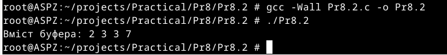

# Практична робота №8
Цей репозиторій cтворений для перегляду виконання практичної роботи №7 з дисципліни "Архітектура системного програмного забезпечення", виконане студентом Щур Р.І., групи ТВ-32.

## Завдання №1
Використайте popen(), щоб передати вивід команди rwho до more (команди UNIX) у програмі на C.

## Виконання

Використовуючи popen(), створено два канали зв'язку: перший для виконання команди rwho, а другий - для виконання команди more з використанням результату виконання першої команди.Так як в системі ніхто не залогінений, крім рута, rwho нічого не виводить, а more просто показує звичайний екран вивід.

## Завдання №2
Є файл, дескриптор якого — fd. Файл містить таку послідовність байтів: 4, 5, 2, 2, 3, 3, 7, 9, 1, 5. У програмі виконується наступна послідовність системних викликів:
lseek(fd, 3, SEEK_SET);
read(fd, &buffer, 4);
де виклик lseek переміщує покажчик на третій байт файлу. Що буде містити буфер після завершення виклику read? Наведіть робочий приклад програми, яка демонструє вашу відповідь.

## Виконання

Програма пропустить перші три байти файлу, покажчик переміститься на 3 байт. Потім вона зчитає 4 байти,адже в програмі вказано,що потрібно зчитати наступні 4 байти (read(fd, &buffer, 4);).

## Завдання №2
Бібліотечна функція qsort призначена для сортування даних будь-якого типу. Для її роботи необхідно підготувати функцію порівняння, яка викликається з qsort кожного разу, коли потрібно порівняти два значення.
 Оскільки значення можуть мати будь-який тип, у функцію порівняння передаються два вказівники типу void* на елементи, що порівнюються.
Напишіть програму, яка досліджує, які вхідні дані є найгіршими для алгоритму швидкого сортування. Спробуйте знайти кілька масивів даних, які змушують qsort працювати якнайповільніше. Автоматизуйте процес експериментування так, щоб підбір і аналіз вхідних даних виконувалися самостійно.
Придумайте і реалізуйте набір тестів для перевірки правильності функції qsort.

## Виконання

Я згенерував три види масивів чисел: один — рандомно згенерований, другий — вже відсортований, а третій — реверсивно відсортований (від більшого до меншого). Для обрахунку часу я використав спосіб із завдання з минулої практичної роботи. Результат показав, що якщо і є якась різниця в часі перевірки, то вона настільки мала, що практично не вимірюється.
